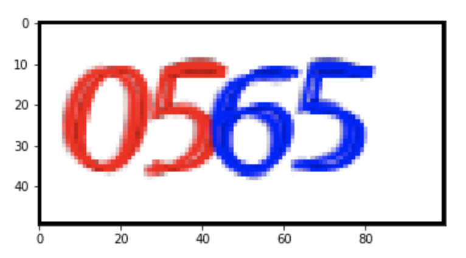

# Captcha-Solver
A captcha-solver based on convolutional neural network.
By the way, this is part of an auto-login system.

## Data
Train data: 2000 four digits image with label.
Test data: 400 four digits image with label. 

## Process
1. Data Preprocessing: Convert images to gray scale and normalize the pixel values.
2. Model: A 7-layer convolutional neural network with dropout. Four output units each has 10 neurons which represent the probabilities of 10 numbers for each four digits.
3. Evaluation: Using accuracy as a metric is good enough for this application.

## Result
Achieve 99.75% accuracy for the test data. Namely there's only 1 wrong prediction out of 400 images!
